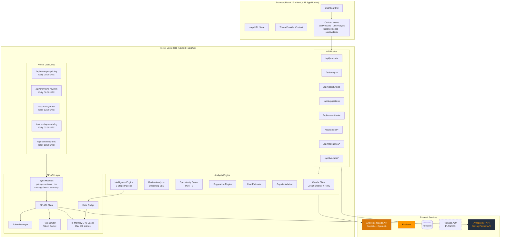
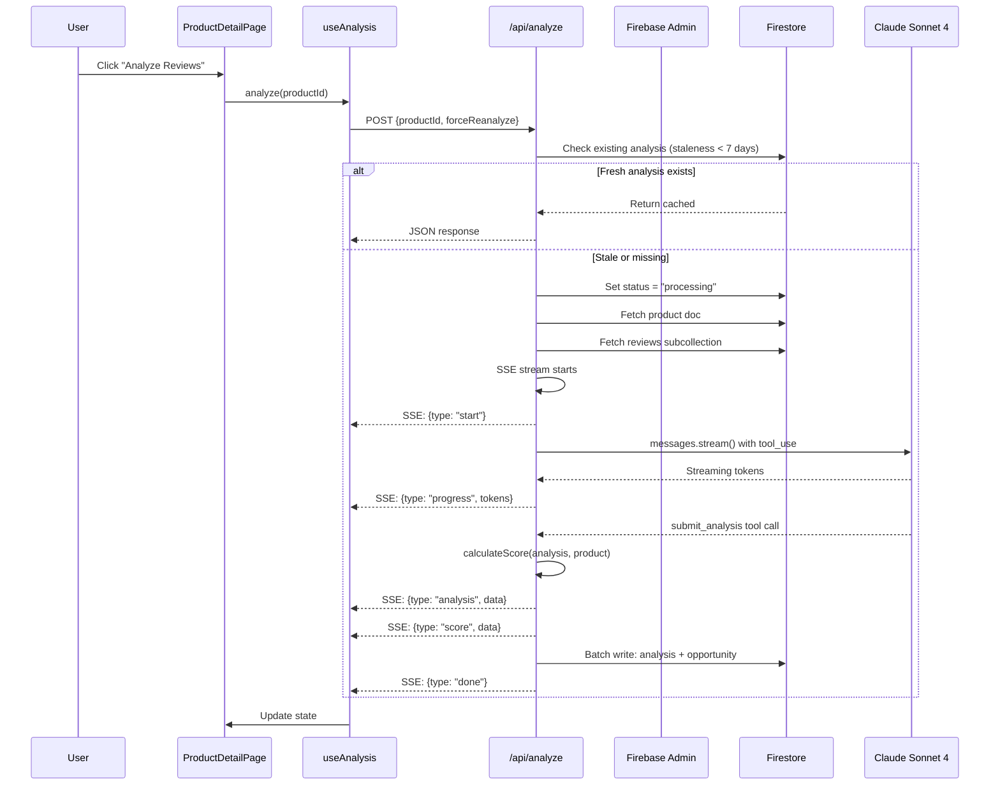
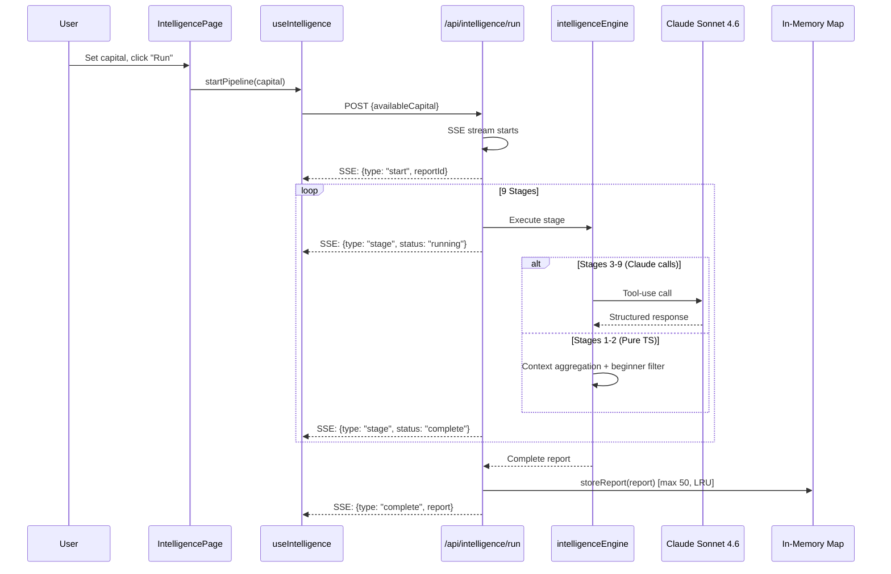
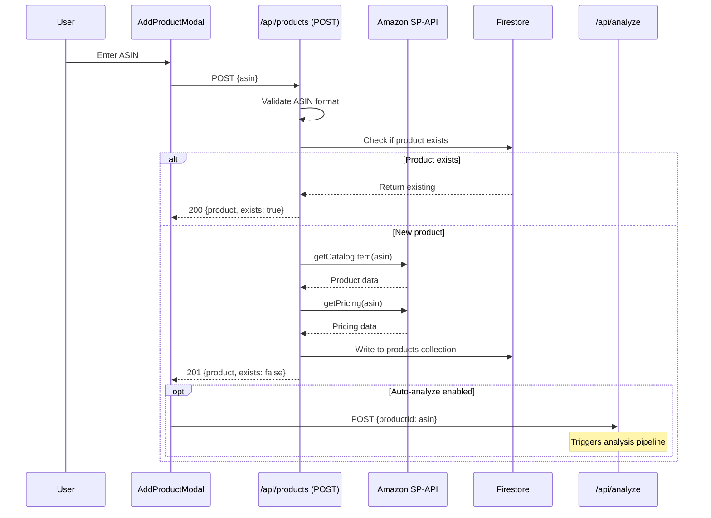
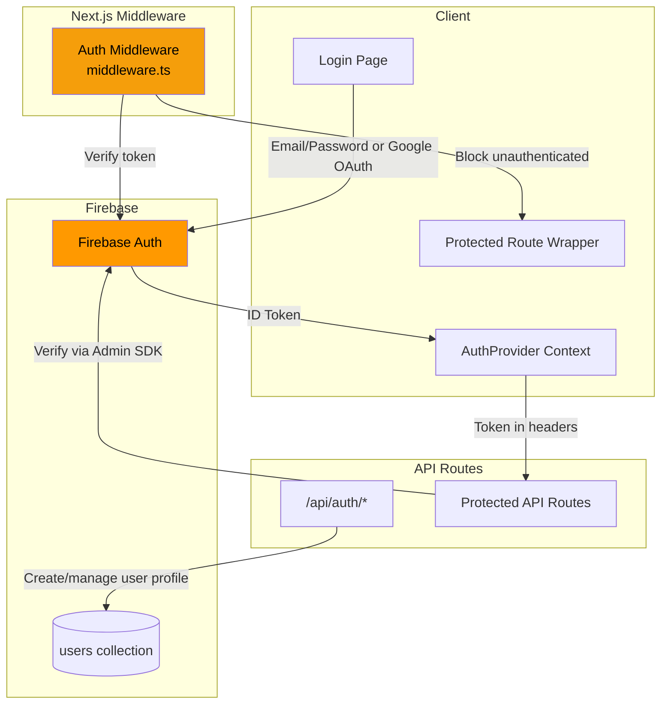
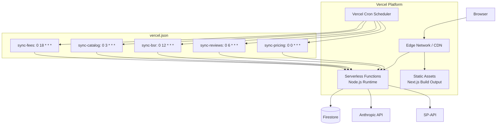

# System Architecture

**Version:** 1.0
**Date:** 2026-03-17
**Status:** Current State + Planned Additions

---

## 1. High-Level System Architecture



---

## 2. Component Hierarchy

```mermaid
graph TD
    RootLayout["RootLayout<br/>src/app/layout.tsx<br/>Geist fonts · NuqsAdapter · ThemeProvider"]

    RootLayout --> HomePage["/ (redirect → /dashboard)<br/>src/app/page.tsx"]
    RootLayout --> DashLayout["DashboardLayout<br/>src/app/dashboard/layout.tsx<br/>Sidebar + main content area"]

    DashLayout --> DashPage["/dashboard<br/>DashboardPage<br/>KPIs · Charts · Top Opps · Suggestions"]
    DashLayout --> ProductsPage["/dashboard/products<br/>ProductsPage<br/>Table/Grid · Filters · Mock Data"]
    DashLayout --> OppsPage["/dashboard/opportunities<br/>OpportunitiesPage<br/>Ranked list · Score breakdowns"]
    DashLayout --> SuggestionsPage["/dashboard/suggestions<br/>SuggestionsPage<br/>SuggestionFeed · Filters"]
    DashLayout --> SuggestionDetail["/dashboard/suggestions/[id]<br/>SuggestionDetailPage<br/>Cost · Supplier · Outreach"]
    DashLayout --> IntelPage["/dashboard/intelligence<br/>IntelligencePage<br/>Landing → Pipeline"]
    DashLayout --> IntelReport["/dashboard/intelligence/[id]<br/>IntelligenceReportPage<br/>Full report view"]
    DashLayout --> LiveDataPage["/dashboard/live-data<br/>LiveDataPage<br/>Sync status · Comparisons"]
    DashLayout --> ProductDetail["/dashboard/product/[asin]<br/>ProductDetailPage<br/>Stats · Score · Analysis"]
    DashLayout --> SettingsPage["/dashboard/settings<br/>SettingsPage<br/>UI-only toggles"]

    DashLayout --> Sidebar["Sidebar<br/>Navigation · Theme toggle · Status"]
```



### Component Inventory

| Directory | Components | Purpose |
|---|---|---|
| `src/components/ui/` | StatusBadge, Skeleton, MiniChart (Line, Bar, Donut) | Shared primitive UI |
| `src/components/dashboard/` | FilterBar, OpportunityTable, ProductCard, ScoreBadge, AnalysisSummary | Product & analysis display |
| `src/components/suggestions/` | SuggestionCard, SuggestionFeed, ViabilityMeter, CostEstimateBreakdown, SupplierCard, SupplierSearchPanel, OutreachMessageDraft | Suggestion workflow |
| `src/components/intelligence/` | IntelligenceLanding, PipelineProgress, VerdictCard, BeginnerFitScore, FinancialModelView, NinetyDayPlaybook, RiskRegister, SuccessProbabilityMeter, DisqualifiedProducts, charts/* | Intelligence reports |
| `src/components/live-data/` | LiveDataBadge, LiveDataOverlay, LiveDataToggle, SyncStatusPanel, CompetitorPriceChart | SP-API data display |
| `src/components/layout/` | Sidebar | Navigation shell |

---

## 3. Data Flow Architecture

### 3.1 Product Analysis Flow (Current — Functional)



### 3.2 Intelligence Pipeline Flow (Current — Functional)



### 3.3 ASIN Ingestion Flow (PLANNED)



---

## 4. Authentication Architecture (PLANNED)



### Auth Flow

1. **Client-side:** Firebase Auth SDK handles sign-in (email/password + Google OAuth)
2. **Token propagation:** ID token stored in AuthProvider context, sent as `Authorization: Bearer <token>` header
3. **Middleware gate:** `middleware.ts` intercepts `/dashboard/*` and `/api/*` (except `/api/auth/*`), redirects to login if no valid session
4. **Server-side verification:** API routes call `admin.auth().verifyIdToken(token)` to validate tokens
5. **User profile:** On first login, create user document in `users` collection with default settings

---

## 5. API Route Architecture

### Route Map

| Method | Path | Auth | Runtime | Max Duration | Purpose |
|---|---|---|---|---|---|
| GET | `/api/products` | Required* | nodejs | Default | List products with filtering + pagination |
| POST | `/api/products` | Required* | nodejs | Default | **PLANNED:** Add product by ASIN |
| POST | `/api/analyze` | Required* | nodejs | Default | Run Claude review analysis (SSE) |
| GET | `/api/opportunities` | Required* | nodejs | Default | List scored opportunities |
| GET | `/api/suggestions` | Required* | nodejs | Default | List product suggestions |
| POST | `/api/suggestions` | Required* | nodejs | Default | Generate new suggestions |
| POST | `/api/cost-estimate` | Required* | nodejs | Default | Generate cost estimate |
| POST | `/api/supplier/search-strategy` | Required* | nodejs | Default | Generate supplier search params |
| POST | `/api/supplier/score` | Required* | nodejs | Default | Score supplier profiles |
| POST | `/api/supplier/draft-message` | Required* | nodejs | Default | Draft outreach email |
| POST | `/api/intelligence/run` | Required* | nodejs | 120s | Run 9-stage intelligence pipeline (SSE) |
| GET | `/api/intelligence/report/[reportId]` | Required* | nodejs | Default | Fetch completed report |
| GET | `/api/live-data/status` | Required* | nodejs | Default | Get SP-API sync status |
| POST | `/api/live-data/sync` | CRON_SECRET | nodejs | Default | Trigger manual sync |
| GET | `/api/live-data/product/[asin]` | Required* | nodejs | Default | Get enriched product data |
| GET | `/api/cron/sync-pricing` | CRON_SECRET | nodejs | Default | Cron: sync pricing data |
| GET | `/api/cron/sync-reviews` | CRON_SECRET | nodejs | Default | Cron: sync review data |
| GET | `/api/cron/sync-bsr` | CRON_SECRET | nodejs | Default | Cron: sync BSR data |
| GET | `/api/cron/sync-catalog` | CRON_SECRET | nodejs | Default | Cron: sync catalog data |
| GET | `/api/cron/sync-fees` | CRON_SECRET | nodejs | Default | Cron: sync fee data |

*Currently unauthenticated. Auth is a planned addition.

### Auth Middleware Pattern

```typescript
// src/middleware.ts (PLANNED)
import { NextRequest, NextResponse } from "next/server";

const PUBLIC_PATHS = ["/", "/login", "/api/auth"];
const CRON_PATHS = ["/api/cron/"];

export function middleware(request: NextRequest) {
  const { pathname } = request.nextUrl;

  // Allow public paths
  if (PUBLIC_PATHS.some(p => pathname === p || pathname.startsWith(p))) {
    return NextResponse.next();
  }

  // Cron paths use CRON_SECRET
  if (CRON_PATHS.some(p => pathname.startsWith(p))) {
    return NextResponse.next(); // Validated in route handler
  }

  // Check for auth token
  const token = request.cookies.get("session")?.value;
  if (!token) {
    return NextResponse.redirect(new URL("/login", request.url));
  }

  return NextResponse.next();
}
```

---

## 6. Caching Strategy

### Three-Layer Cache Architecture

```
┌─────────────────────────────────────────────────┐
│  Layer 1: Client-Side (Browser)                 │
│  • nuqs URL state (filter params)               │
│  • React state (hook-level)                     │
│  • localStorage (theme preference)              │
│  • No HTTP caching (SSE + dynamic routes)       │
├─────────────────────────────────────────────────┤
│  Layer 2: In-Memory Server (per Vercel instance) │
│  • SPAPICache: LRU, max 500 entries, TTL-based  │
│  • Intelligence reportStore: max 50, LRU        │
│  • Claude circuit breaker state                 │
│  • Token manager (SP-API access token)          │
│  NOTE: Not shared across instances! Stateless.  │
├─────────────────────────────────────────────────┤
│  Layer 3: Firestore (persistent)                │
│  • Products, analyses, opportunities            │
│  • 7-day staleness check for analysis cache     │
│  • PLANNED: User settings, intelligence reports │
└─────────────────────────────────────────────────┘
```

### SP-API Cache TTLs

| Data Type | Cache TTL | Rationale |
|---|---|---|
| Catalog | 86,400s (24h) | Product info changes rarely |
| Pricing | 3,600s (1h) | Prices change frequently |
| BSR | 1,800s (30min) | BSR is highly volatile |
| Reviews | 21,600s (6h) | Review counts change moderately |
| Inventory | 3,600s (1h) | Inventory levels change with sales |
| Fees | 7,200s (2h) | Fee structures change infrequently |

### Critical Limitation

All in-memory caches (SPAPICache, reportStore, circuit breaker state) are **per-instance** on Vercel serverless. Different API invocations may run on different instances with cold caches. The intelligence reportStore is especially impacted — reports generated in one invocation may not be retrievable in another. This is the primary driver for migrating to Firestore persistence.

---

## 7. Error Handling Strategy

### Circuit Breaker (Anthropic API)

```
State Machine:
  CLOSED ──(5 failures in 10min)──> OPEN ──(60s cooldown)──> HALF-OPEN ──(success)──> CLOSED
                                                                        ──(failure)──> OPEN

Config:
  windowMs: 600,000 (10 minutes)
  threshold: 5 failures
  cooldownMs: 60,000 (60 seconds)

Non-retryable HTTP codes: 400, 401, 403, 404 (fail fast, still counts as failure)
```

Location: `src/lib/analysis/claudeClient.ts`

### Retry Logic

```
withRetry(fn, maxAttempts=3, baseDelayMs=1000)
  Attempt 1: immediate
  Attempt 2: ~2000ms + random(0-500ms)
  Attempt 3: ~4000ms + random(0-500ms)

  Respects circuit breaker state (throws CircuitOpenError if open)
  Skips retry for non-retryable errors (4xx)
```

### Error Classes

| Class | Thrown By | Meaning |
|---|---|---|
| `AnalysisError` | `claudeReviewAnalyzer.ts` | Analysis failed after retries |
| `CircuitOpenError` | `claudeClient.ts` | Too many recent failures; circuit is open |
| `Anthropic.APIError` | Anthropic SDK | HTTP-level API error |

### API Route Error Handling Pattern

All API routes follow this pattern:
1. Input validation with specific 400 errors
2. Try-catch around business logic
3. Generic error message to client (`"Failed to fetch products"`)
4. Detailed logging server-side (`console.error("[API /products] Error:", error)`)
5. SSE endpoints emit `{type: "error", message}` events before closing stream

---

## 8. Environment Variables

### Required for Production

| Variable | Used By | Purpose |
|---|---|---|
| `NEXT_PUBLIC_FIREBASE_API_KEY` | `firebase/client.ts` | Client-side Firebase init |
| `NEXT_PUBLIC_FIREBASE_AUTH_DOMAIN` | `firebase/client.ts` | Client-side Firebase init |
| `NEXT_PUBLIC_FIREBASE_PROJECT_ID` | `firebase/client.ts` | Client-side Firebase init |
| `NEXT_PUBLIC_FIREBASE_STORAGE_BUCKET` | `firebase/client.ts` | Client-side Firebase init |
| `NEXT_PUBLIC_FIREBASE_MESSAGING_SENDER_ID` | `firebase/client.ts` | Client-side Firebase init |
| `NEXT_PUBLIC_FIREBASE_APP_ID` | `firebase/client.ts` | Client-side Firebase init |
| `FIREBASE_ADMIN_PROJECT_ID` | `firebase/admin.ts` | Server-side Firestore |
| `FIREBASE_ADMIN_CLIENT_EMAIL` | `firebase/admin.ts` | Server-side Firestore |
| `FIREBASE_ADMIN_PRIVATE_KEY` | `firebase/admin.ts` | Server-side Firestore (fail-secure) |
| `ANTHROPIC_API_KEY` | `claudeClient.ts` | Claude API access |
| `CRON_SECRET` | Cron + sync routes | Cron job authentication |

### Optional (Feature Flags)

| Variable | Default | Purpose |
|---|---|---|
| `AMAZON_SP_API_ENABLED` | `"false"` | Gate SP-API features |
| `AMAZON_SP_API_CLIENT_ID` | — | SP-API OAuth |
| `AMAZON_SP_API_CLIENT_SECRET` | — | SP-API OAuth |
| `AMAZON_SP_API_REFRESH_TOKEN` | — | SP-API OAuth |

---

## 9. Deployment Architecture



### Constraints

- **Max function duration:** 120 seconds (Vercel Pro). Intelligence pipeline uses `maxDuration = 120`.
- **Stateless functions:** No shared in-memory state between invocations.
- **Cold starts:** First invocation after idle period incurs ~500ms cold start.
- **Cron limitations:** Vercel Hobby allows 2 cron jobs; Pro allows unlimited. 5 are configured.
- **Bundle size:** Turbopack used for dev and build. `@anthropic-ai/sdk` and `firebase-admin` are the largest dependencies.
