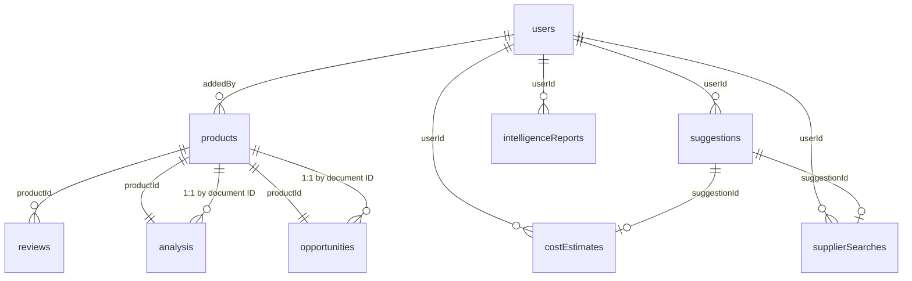

# Data Models

**Version:** 1.0
**Date:** 2026-03-17

All data is stored in Firebase Firestore (NoSQL, document-based). This document specifies every collection, its document schema, relationships, required indexes, and query patterns.

---

## 1. Collection Overview

```
Firestore Root
├── users/{uid}                          ← PLANNED
├── products/{asin}                      ← EXISTS (partially used)
├── reviews/{reviewId}                   ← EXISTS (used by /api/analyze)
├── analysis/{productId}                 ← EXISTS (written by /api/analyze)
├── opportunities/{productId}            ← EXISTS (written by /api/analyze)
├── suggestions/{suggestionId}           ← PLANNED (currently mock)
├── costEstimates/{estimateId}           ← PLANNED (currently mock)
├── supplierSearches/{searchId}          ← PLANNED (currently mock)
├── intelligenceReports/{reportId}       ← PLANNED (currently in-memory)
└── syncStatus/{syncType}                ← PLANNED (currently mock)
```

---

## 2. users (PLANNED)

Created on first sign-in. Stores user profile and settings.

```typescript
// Collection: users
// Document ID: Firebase Auth UID

interface UserDocument {
  // Identity
  uid: string;
  email: string;
  displayName: string;
  photoURL: string | null;
  authProvider: "email" | "google";

  // Settings
  settings: {
    autoAnalyzeNewProducts: boolean;   // default: true
    enableResponseCaching: boolean;    // default: true
    claudeModel: string;               // default: "claude-sonnet-4-20250514"
    maxReviewsPerBatch: number;        // default: 50
    analysisCompletionAlerts: boolean; // default: true
    theme: "light" | "dark";          // default: "dark"
  };

  // Usage tracking
  productsAdded: number;               // counter
  analysesRun: number;                 // counter
  intelligenceReportsRun: number;      // counter

  // Timestamps
  createdAt: Timestamp;
  updatedAt: Timestamp;
  lastLoginAt: Timestamp;
}
```

**Indexes:** None required (queried by document ID only).

**Security Rules:**
```
match /users/{uid} {
  allow read, write: if request.auth.uid == uid;
}
```

---

## 3. products

Stores Amazon product data. Document ID is the ASIN.

```typescript
// Collection: products
// Document ID: ASIN (e.g., "B09V3KXJPB")

interface ProductDocument {
  id: string;                    // Same as document ID (ASIN)
  asin: string;
  title: string;
  brand: string;
  category: string;
  subcategory: string;
  price: number;
  rating: number;                // 0.0 - 5.0
  reviewCount: number;
  bsr: number;                   // Best Seller Rank
  imageUrl: string;
  productUrl: string;
  estimatedMonthlySales: number;
  estimatedMonthlyRevenue: number;
  profitMarginEstimate: number;  // 0.0 - 1.0

  // Metadata
  dataSource: "spapi" | "manual" | "seed";
  addedBy: string;               // User UID (PLANNED)
  createdAt: Timestamp;
  updatedAt: Timestamp;
}
```

**Indexes Required:**

| Fields | Order | Used By |
|---|---|---|
| `category` ASC, `createdAt` DESC | Composite | `/api/products?category=X&sortBy=createdAt` |
| `category` ASC, `price` DESC | Composite | `/api/products?category=X&sortBy=price` |
| `category` ASC, `rating` DESC | Composite | `/api/products?category=X&sortBy=rating` |
| `category` ASC, `reviewCount` DESC | Composite | `/api/products?category=X&sortBy=reviewCount` |
| `category` ASC, `bsr` DESC | Composite | `/api/products?category=X&sortBy=bsr` |
| `category` ASC, `title` DESC | Composite | `/api/products?category=X&sortBy=title` |
| `createdAt` DESC | Single-field | Default sort |

**Query Patterns:**
```
// List products with category filter + pagination
products.where("category", "==", X).orderBy(sortBy, "desc").limit(N).startAfter(cursor)

// Get single product by ASIN
products.doc(asin).get()

// All products (for cron sync)
products.orderBy("createdAt").get()
```

---

## 4. reviews

Stores individual product reviews. Used as input for Claude analysis.

```typescript
// Collection: reviews
// Document ID: auto-generated

interface ReviewDocument {
  id: string;
  productId: string;             // References products/{asin}
  reviewerName: string;
  rating: number;                // 1-5
  title: string;
  body: string;
  verifiedPurchase: boolean;
  helpfulVotes: number;
  reviewDate: Timestamp;
  createdAt: Timestamp;
}
```

**Indexes Required:**

| Fields | Order | Used By |
|---|---|---|
| `productId` ASC | Single-field | `/api/analyze` — fetch reviews for a product |

**Query Patterns:**
```
// All reviews for a product
reviews.where("productId", "==", asin).get()
```

---

## 5. analysis

Stores Claude analysis results. Document ID matches the product ASIN (1:1 relationship).

```typescript
// Collection: analysis
// Document ID: ASIN (same as product ID)

interface AnalysisDocument {
  id: string;                    // Same as product ASIN
  productId: string;             // References products/{asin}
  status: "pending" | "processing" | "complete" | "failed";
  reviewsAnalyzed: number;

  // Claude output
  complaints: Array<{
    issue: string;
    frequency: "very_common" | "common" | "occasional" | "rare";
    severity: "critical" | "major" | "minor";
    exampleQuotes: string[];     // Max 3
  }>;
  featureRequests: Array<{
    feature: string;
    demandLevel: "high" | "medium" | "low";
    mentionCount: number;
  }>;
  productGaps: Array<{
    gap: string;
    opportunity: string;
    competitiveAdvantage: string;
  }>;
  sentimentBreakdown: {
    positive: number;            // 0-100
    neutral: number;             // 0-100
    negative: number;            // 0-100
  };
  opportunitySummary: string;
  improvementIdeas: string[];    // Max 5
  keyThemes: string[];           // Max 8

  // Metadata
  claudeModel: string;
  promptTokens: number;
  completionTokens: number;
  processingTimeMs: number;
  createdAt: Timestamp;
  updatedAt: Timestamp;
}
```

**Indexes Required:** None beyond default `__name__` index (queried by document ID).

**Query Patterns:**
```
// Get analysis for a product
analysis.doc(productId).get()

// Check staleness
analysis.doc(productId).get() → check createdAt age < 7 days
```

---

## 6. opportunities

Stores opportunity scores derived from analysis. Document ID matches product ASIN (1:1 relationship).

```typescript
// Collection: opportunities
// Document ID: ASIN (same as product ID)

interface OpportunityDocument {
  id: string;                    // Same as product ASIN
  productId: string;             // References products/{asin}
  opportunityScore: number;      // 0-100
  scoreBreakdown: {
    demandScore: number;         // 0-25
    competitionScore: number;    // 0-25
    marginScore: number;         // 0-25
    sentimentScore: number;      // 0-25
  };
  tier: "S" | "A" | "B" | "C" | "D";
  recommendation: "strong_buy" | "buy" | "watch" | "avoid";
  createdAt: Timestamp;
}
```

**Indexes Required:**

| Fields | Order | Used By |
|---|---|---|
| `opportunityScore` DESC | Single-field | `/api/opportunities` default sort |
| `tier` ASC, `opportunityScore` DESC | Composite | `/api/opportunities?tier=S` |
| `recommendation` ASC, `opportunityScore` DESC | Composite | `/api/opportunities?recommendation=strong_buy` |
| `productId` ASC | Single-field | Join query in `/api/products` |

**Query Patterns:**
```
// Top opportunities
opportunities.orderBy("opportunityScore", "desc").limit(N)

// Filter by tier
opportunities.where("tier", "==", T).orderBy("opportunityScore", "desc")

// Batch lookup by product IDs (for /api/products join)
opportunities.where("productId", "in", [...chunk]).get()
// Note: Firestore 'in' supports max 30 values per query
```

---

## 7. suggestions (PLANNED)

Stores AI-generated product suggestions.

```typescript
// Collection: suggestions
// Document ID: auto-generated (e.g., "sug-1710000000000-0")

interface SuggestionDocument {
  id: string;
  userId: string;                // References users/{uid}
  sourceProductIds: string[];    // ASINs that inspired this suggestion
  sourceAnalysisIds: string[];

  // Product idea
  title: string;
  description: string;
  category: string;
  subcategory: string;
  targetCustomer: string;
  targetPrice: number;

  // Rationale
  painPointsAddressed: Array<{
    issue: string;
    affectedPercentage: number;  // 0-100
    proposedSolution: string;
  }>;
  differentiators: string[];
  trendSignals: Array<{
    signal: string;
    source: "google_trends" | "amazon_movers" | "social" | "claude_inference";
    strength: "strong" | "moderate" | "emerging";
  }>;
  riskFactors: Array<{
    risk: string;
    severity: "high" | "medium" | "low";
    mitigation: string;
  }>;

  // Scores
  viabilityScore: number;        // 0-100
  viabilityBreakdown: {
    demandConfidence: number;    // 0-25
    differentiationStrength: number; // 0-25
    marginPotential: number;     // 0-25
    executionFeasibility: number; // 0-25
  };
  tier: "S" | "A" | "B" | "C";

  // Workflow state
  status: "draft" | "estimated" | "sourcing" | "archived";
  costEstimateId: string | null;
  supplierSearchId: string | null;

  // Metadata
  generatedBy: "gap_analysis" | "trend_expansion" | "hybrid";
  claudeModel: string;
  createdAt: Timestamp;
  updatedAt: Timestamp;
}
```

**Indexes Required:**

| Fields | Order | Used By |
|---|---|---|
| `userId` ASC, `viabilityScore` DESC | Composite | List user's suggestions sorted by score |
| `userId` ASC, `category` ASC, `viabilityScore` DESC | Composite | Filter by category |
| `userId` ASC, `tier` ASC | Composite | Filter by tier |

**Query Patterns:**
```
// User's suggestions sorted by score
suggestions.where("userId", "==", uid).orderBy("viabilityScore", "desc")

// Filter by category
suggestions.where("userId", "==", uid).where("category", "==", cat).orderBy("viabilityScore", "desc")
```

---

## 8. costEstimates (PLANNED)

Stores cost estimates linked to suggestions.

```typescript
// Collection: costEstimates
// Document ID: auto-generated (e.g., "ce-1710000000000")

interface CostEstimateDocument {
  id: string;
  suggestionId: string;          // References suggestions/{id}
  userId: string;                // References users/{uid}

  sourcingCosts: {
    unitCost: number;
    moqUnits: number;
    moqTotalCost: number;
    sampleCost: number;
  };
  shippingCosts: {
    seaFreight: number;
    customsDuty: number;
    importFees: number;
    totalPerUnit: number;
  };
  amazonFees: {
    fbaFulfillmentFee: number;
    referralFee: number;
    storageFeeMonthly: number;
    totalPerUnit: number;
  };
  launchBudget: {
    productPhotography: number;
    brandingAndPackaging: number;
    sampleOrdering: number;
    ppcLaunchBudget: number;
    amazonStorefront: number;
    totalOneTime: number;
  };

  contingencyBuffer: number;
  totalStartupCapital: number;
  targetSalePrice: number;
  estimatedNetMargin: number;    // 0.0 - 1.0
  breakEvenUnits: number;
  breakEvenMonths: number;
  roi12Month: number;
  monthlyProjections: Array<{
    month: number;
    unitsSold: number;
    revenue: number;
    totalCosts: number;
    profit: number;
    cumulativeProfit: number;
  }>;

  assumptions: string[];
  claudeModel: string;
  createdAt: Timestamp;
}
```

**Indexes Required:**

| Fields | Order | Used By |
|---|---|---|
| `suggestionId` ASC | Single-field | Lookup cost estimate for a suggestion |

---

## 9. supplierSearches (PLANNED)

Stores supplier search results linked to suggestions.

```typescript
// Collection: supplierSearches
// Document ID: auto-generated

interface SupplierSearchDocument {
  id: string;
  suggestionId: string;          // References suggestions/{id}
  userId: string;                // References users/{uid}

  searchKeywords: string[];
  productSpec: {
    productName: string;
    keyMaterials: string[];
    targetDimensions: string;
    targetWeight: string;
    requiredCertifications: string[];
    packagingRequirements: string;
    customizationNeeds: string[];
    targetUnitCost: number;
    targetMOQ: number;
  };
  filterCriteria: {
    minYearsInBusiness: number;
    minTradeAssuranceUSD: number;
    requiredVerifications: string[];
    minResponseRate: number;
    maxMOQ: number;
    maxLeadTimeDays: number;
    preferredRegions: string[];
  };

  suppliers: Array<{
    id: string;
    companyName: string;
    location: string;
    yearsInBusiness: number;
    mainProducts: string[];
    tradeAssuranceUSD: number;
    verifications: string[];
    responseRate: number;
    reviewScore: number;
    moq: number;
    leadTimeDays: number;
    sampleCost: number;
    totalScore: number;
    scoreBreakdown: {
      reliabilityScore: number;
      qualityScore: number;
      commercialScore: number;
      fitScore: number;
    };
    rank: number;
    pros: string[];
    cons: string[];
    recommendation: string;
  }>;
  recommendedSupplierId: string;

  outreachMessage?: {
    subject: string;
    body: string;
    tone: "professional" | "friendly_professional";
    variants: Array<{
      label: string;
      subject: string;
      body: string;
    }>;
  };

  claudeModel: string;
  createdAt: Timestamp;
}
```

**Indexes Required:**

| Fields | Order | Used By |
|---|---|---|
| `suggestionId` ASC | Single-field | Lookup supplier search for a suggestion |

---

## 10. intelligenceReports (PLANNED)

Stores full intelligence pipeline reports. Currently in-memory only.

```typescript
// Collection: intelligenceReports
// Document ID: UUID (e.g., "550e8400-e29b-41d4-a716-446655440000")

interface IntelligenceReportDocument {
  id: string;
  userId: string;                // References users/{uid}
  status: "pending" | "running" | "complete" | "failed";

  sellerProfile: {
    experienceLevel: "beginner";
    availableCapital: { min: number; max: number };
    priorities: string[];
    hardDisqualifiers: string[];
  };
  inputContext: {
    availableCapital: number;
    hardDeadlineDays?: number;
    categoryPreferences?: string[];
  };

  // All nullable — populated as stages complete
  verdict: ProductVerdict | null;
  beginnerFitAssessment: BeginnerFitAssessment | null;
  financialModel: FinancialModel | null;
  ninetyDayPlaybook: NinetyDayPlaybook | null;
  riskRegister: RiskRegister | null;
  successProbability: SuccessProbability | null;
  disqualifiedProducts: DisqualifiedProduct[];

  tokenUsage: {
    totalInputTokens: number;
    totalOutputTokens: number;
    byStage: Record<string, { input: number; output: number }>;
  };

  createdAt: string;             // ISO 8601
  completedAt: string | null;    // ISO 8601
}
```

**Note:** The full type definitions for nested objects (ProductVerdict, BeginnerFitAssessment, FinancialModel, NinetyDayPlaybook, RiskRegister, SuccessProbability, DisqualifiedProduct) are defined in `src/lib/types/intelligence.ts` and total ~260 lines. They are stored as-is in the Firestore document (Firestore supports deeply nested objects).

**Indexes Required:**

| Fields | Order | Used By |
|---|---|---|
| `userId` ASC, `createdAt` DESC | Composite | List user's reports |

**Query Patterns:**
```
// User's reports, newest first
intelligenceReports.where("userId", "==", uid).orderBy("createdAt", "desc").limit(N)

// Single report
intelligenceReports.doc(reportId).get()
```

---

## 11. syncStatus (PLANNED)

Stores SP-API sync status. One document per sync type.

```typescript
// Collection: syncStatus
// Document ID: SyncType (e.g., "pricing", "reviews")

interface SyncStatusDocument {
  type: "catalog" | "pricing" | "reviews" | "bsr" | "inventory" | "fees";
  lastSyncAt: Timestamp | null;
  nextSyncAt: Timestamp | null;
  status: "idle" | "syncing" | "success" | "error";
  itemCount: number;
  errors: string[];
  updatedAt: Timestamp;
}
```

**Indexes Required:** None (queried by document ID or full collection scan — max 6 documents).

---

## 12. Collection Relationships



**Key relationships:**
- `products` ←→ `analysis`: 1:1, same document ID (ASIN)
- `products` ←→ `opportunities`: 1:1, same document ID (ASIN)
- `products` → `reviews`: 1:many, linked by `productId` field
- `suggestions` → `costEstimates`: 1:0..1, linked by `suggestionId` field
- `suggestions` → `supplierSearches`: 1:0..1, linked by `suggestionId` field
- `users` → all collections: ownership via `userId` field

**Note:** Firestore is NoSQL — these are not enforced foreign keys. Referential integrity is maintained by application logic.

---

## 13. Composite Index Definitions

These must be created in Firebase Console or via `firestore.indexes.json`:

```json
{
  "indexes": [
    {
      "collectionGroup": "products",
      "queryScope": "COLLECTION",
      "fields": [
        { "fieldPath": "category", "order": "ASCENDING" },
        { "fieldPath": "createdAt", "order": "DESCENDING" }
      ]
    },
    {
      "collectionGroup": "products",
      "queryScope": "COLLECTION",
      "fields": [
        { "fieldPath": "category", "order": "ASCENDING" },
        { "fieldPath": "price", "order": "DESCENDING" }
      ]
    },
    {
      "collectionGroup": "products",
      "queryScope": "COLLECTION",
      "fields": [
        { "fieldPath": "category", "order": "ASCENDING" },
        { "fieldPath": "rating", "order": "DESCENDING" }
      ]
    },
    {
      "collectionGroup": "products",
      "queryScope": "COLLECTION",
      "fields": [
        { "fieldPath": "category", "order": "ASCENDING" },
        { "fieldPath": "reviewCount", "order": "DESCENDING" }
      ]
    },
    {
      "collectionGroup": "products",
      "queryScope": "COLLECTION",
      "fields": [
        { "fieldPath": "category", "order": "ASCENDING" },
        { "fieldPath": "bsr", "order": "DESCENDING" }
      ]
    },
    {
      "collectionGroup": "opportunities",
      "queryScope": "COLLECTION",
      "fields": [
        { "fieldPath": "tier", "order": "ASCENDING" },
        { "fieldPath": "opportunityScore", "order": "DESCENDING" }
      ]
    },
    {
      "collectionGroup": "opportunities",
      "queryScope": "COLLECTION",
      "fields": [
        { "fieldPath": "recommendation", "order": "ASCENDING" },
        { "fieldPath": "opportunityScore", "order": "DESCENDING" }
      ]
    },
    {
      "collectionGroup": "suggestions",
      "queryScope": "COLLECTION",
      "fields": [
        { "fieldPath": "userId", "order": "ASCENDING" },
        { "fieldPath": "viabilityScore", "order": "DESCENDING" }
      ]
    },
    {
      "collectionGroup": "suggestions",
      "queryScope": "COLLECTION",
      "fields": [
        { "fieldPath": "userId", "order": "ASCENDING" },
        { "fieldPath": "category", "order": "ASCENDING" },
        { "fieldPath": "viabilityScore", "order": "DESCENDING" }
      ]
    },
    {
      "collectionGroup": "intelligenceReports",
      "queryScope": "COLLECTION",
      "fields": [
        { "fieldPath": "userId", "order": "ASCENDING" },
        { "fieldPath": "createdAt", "order": "DESCENDING" }
      ]
    }
  ]
}
```

---

## 14. Data Size Estimates

| Collection | Docs (MVP) | Avg Doc Size | Total |
|---|---|---|---|
| users | 1-10 | ~1 KB | ~10 KB |
| products | 16-100 | ~500 B | ~50 KB |
| reviews | 1,000-10,000 | ~300 B | ~3 MB |
| analysis | 16-100 | ~3 KB | ~300 KB |
| opportunities | 16-100 | ~200 B | ~20 KB |
| suggestions | 10-50 | ~2 KB | ~100 KB |
| costEstimates | 5-20 | ~3 KB | ~60 KB |
| supplierSearches | 5-20 | ~5 KB | ~100 KB |
| intelligenceReports | 10-50 | ~20 KB | ~1 MB |
| syncStatus | 6 | ~200 B | ~1.2 KB |

**Total estimated storage:** ~5 MB for MVP. Well within Firestore free tier (1 GiB).

---

## 15. Firestore Security Rules (PLANNED)

```javascript
rules_version = '2';
service cloud.firestore {
  match /databases/{database}/documents {
    // Users can only access their own document
    match /users/{uid} {
      allow read, write: if request.auth != null && request.auth.uid == uid;
    }

    // Products are readable by any authenticated user
    // Writable via admin SDK only (API routes)
    match /products/{asin} {
      allow read: if request.auth != null;
      allow write: if false; // Server-side only via admin SDK
    }

    // Reviews readable by authenticated users
    match /reviews/{reviewId} {
      allow read: if request.auth != null;
      allow write: if false;
    }

    // Analysis readable by authenticated users
    match /analysis/{productId} {
      allow read: if request.auth != null;
      allow write: if false;
    }

    // Opportunities readable by authenticated users
    match /opportunities/{productId} {
      allow read: if request.auth != null;
      allow write: if false;
    }

    // User-owned collections
    match /suggestions/{suggestionId} {
      allow read: if request.auth != null
                  && resource.data.userId == request.auth.uid;
      allow write: if false;
    }

    match /costEstimates/{estimateId} {
      allow read: if request.auth != null
                  && resource.data.userId == request.auth.uid;
      allow write: if false;
    }

    match /supplierSearches/{searchId} {
      allow read: if request.auth != null
                  && resource.data.userId == request.auth.uid;
      allow write: if false;
    }

    match /intelligenceReports/{reportId} {
      allow read: if request.auth != null
                  && resource.data.userId == request.auth.uid;
      allow write: if false;
    }

    // Sync status readable by authenticated users
    match /syncStatus/{type} {
      allow read: if request.auth != null;
      allow write: if false;
    }
  }
}
```

**Note:** All writes go through the Firebase Admin SDK (server-side API routes), which bypasses security rules. The rules above protect direct client-side access. All data mutation happens server-side with proper auth verification.
